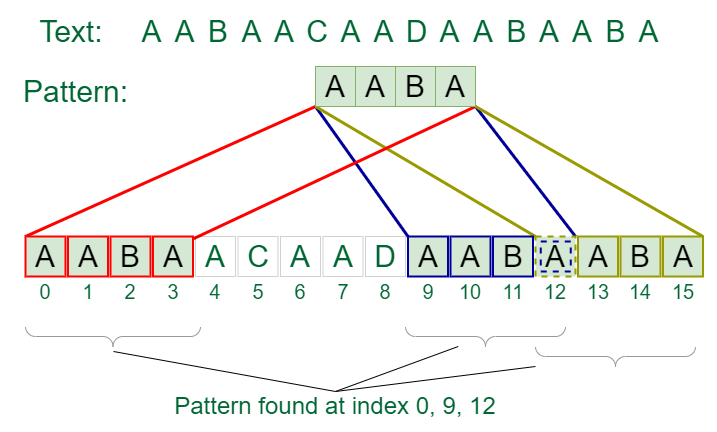

- [How the Naive String Search Algorithm Works](#how-the-naive-string-search-algorithm-works)
- [Pseudocode](#pseudocode)
- [Algorithm](#algorithm)
- [Examples](#examples)
- [Time Complexity](#time-complexity)
- [Advantages](#advantages)
- [Disadvantages](#disadvantages)
- [Conclusion](#conclusion)

The naive string search algorithm is one of the simplest and most straightforward methods for finding a substring within a larger string (or text). Here’s a deeper look into how it works, its advantages, disadvantages, and examples.

## How the Naive String Search Algorithm Works

1. **Basic Concept**: The algorithm checks every possible position in the text where the substring might start and compares the characters of the substring with the characters in the text.

2. **Steps**:
   - **Initialization**: Start from the first character of the text.
   - **Outer Loop**: Iterate through the text from the beginning to the point where the substring can fit. The loop runs from index `0` to `n - m`, where `n` is the length of the text and `m` is the length of the substring.
   - **Inner Loop**: For each position `i`, compare the substring with the segment of the text starting at position `i`.
     - If all characters match, the substring is found at index `i`, and you can record or print the position.
     - If a mismatch occurs, break the inner loop and move to the next character in the text.

3. **Termination**: The process continues until the end of the text is reached.

## Pseudocode

Here’s a simple representation of the naive string search algorithm in pseudocode:

```plaintext
function naive_search(text, pattern):
    n = length(text)
    m = length(pattern)

    for i from 0 to n - m:
        j = 0
        while j < m and text[i + j] == pattern[j]:
            j += 1
        if j == m:
            print("Pattern found at index", i)
```

## Algorithm
```c
#include <stdio.h>
#include <string.h>

// Function to perform the naive string search
void naive_search(const char *text, const char *pattern) {
    int n = strlen(text);
    int m = strlen(pattern);

    // Loop through each position in the text
    for (int i = 0; i <= n - m; i++) {
        int j = 0;

        // Compare the pattern with the current segment of the text
        while (j < m && text[i + j] == pattern[j]) {
            j++;
        }

        // If we reached the end of the pattern, we found a match
        if (j == m) {
            printf("Pattern found at index %d\n", i);
        }
    }
}

int main() {
    const char *text = "ababcabcabababd";
    const char *pattern = "abab";

    naive_search(text, pattern); // Call the naive search function

    return 0;
}


```

## Examples

1. Consider the text `text = "ababcabcabababd"` and the substring `pattern = "abab"`.

   1. **Iteration 1**:
      - Compare `text[0..3]` with `pattern[0..3]`: `"abab"` == `"abab"` (match found at index `0`).

   2. **Iteration 2**:
      - Compare `text[1..4]` with `pattern[0..3]`: `"babc"` != `"abab"` (mismatch).

   3. **Iteration 3**:
      - Compare `text[2..5]` with `pattern[0..3]`: `"abca"` != `"abab"` (mismatch).

   4. **Iteration 4**:
      - Compare `text[3..6]` with `pattern[0..3]`: `"bacb"` != `"abab"` (mismatch).

   5. **Iteration 5**:
      - Compare `text[4..7]` with `pattern[0..3]`: `"abab"` == `"abab"` (match found at index `4`).

```plaintext
2. Input:  text = “THIS IS A TEST TEXT”, pattern = “TEST”
Output: Pattern found at index 10

Input:  text =  “AABAACAADAABAABA”, pattern = “AABA”
Output: Pattern found at index 0, Pattern found at index 9, Pattern found at index 12
```


## Time Complexity

- **Worst-case Complexity**: O(m * n)
  - In the worst case, for each of the `n` positions in the text, you might need to check `m` characters of the substring.

- **Best-case Complexity**: O(n)
  - If the substring is found at the very beginning, the algorithm only needs to check the first few characters.

## Advantages

- **Simplicity**: Easy to understand and implement, making it a good choice for educational purposes and small datasets.
- **No Preprocessing Required**: Unlike some other algorithms, the naive approach does not require any preprocessing of the substring or the text.

## Disadvantages

- **Inefficiency for Large Texts**: The naive approach can be quite slow for large texts and patterns, especially if there are many mismatches.
- **Unoptimized**: It does not take advantage of any information about the substring or text to skip unnecessary comparisons.

## Conclusion

The naive string search algorithm serves as a foundational method for understanding more advanced string matching algorithms. While it is not efficient for large datasets, it is a good starting point for grasping the basic principles of string searching. For practical applications, especially with larger strings or when searching for multiple patterns, more efficient algorithms like KMP or Boyer-Moore are preferred.
