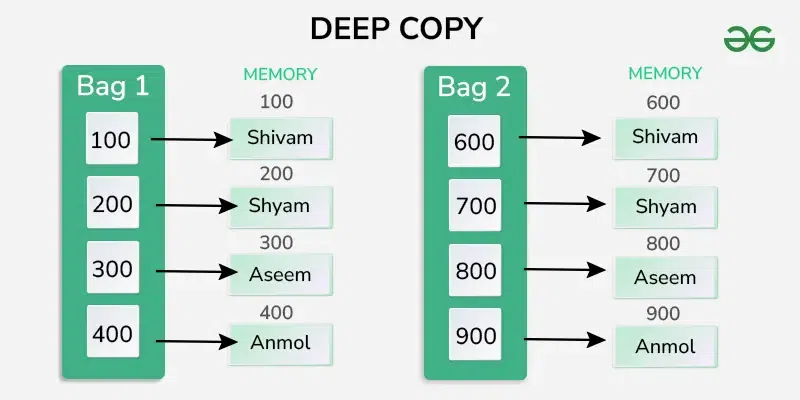
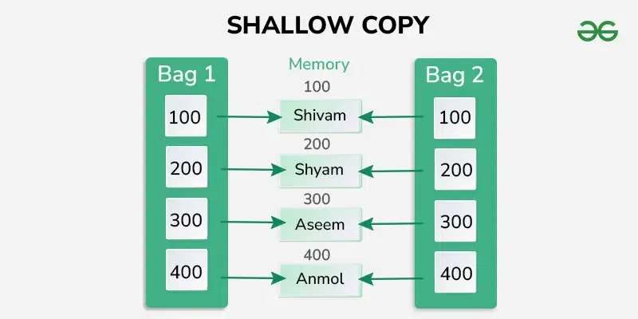

- [C++ Copy Constructor](#c-copy-constructor)
    - [**Key Features of a Copy Constructor**](#key-features-of-a-copy-constructor)
    - [**Syntax of a Copy Constructor**](#syntax-of-a-copy-constructor)
    - [**Example of a Copy Constructor**](#example-of-a-copy-constructor)
    - [**When is a Copy Constructor Called?**](#when-is-a-copy-constructor-called)
    - [**Shallow Copy vs Deep Copy**](#shallow-copy-vs-deep-copy)
    - [**Shallow Copy**](#shallow-copy)
    - [**Deep Copy**](#deep-copy)
    - [**Example of Deep Copy in a Copy Constructor**](#example-of-deep-copy-in-a-copy-constructor)
    - [**Best Practices for Copy Constructors**](#best-practices-for-copy-constructors)

# C++ Copy Constructor

A **copy constructor** in C++ is a special constructor used to create a new object as a copy of an existing object. It initializes the new object by copying the data members of an existing object.

### **Key Features of a Copy Constructor**

- **Purpose**: To perform member-wise initialization or deep copying of data members when an object is initialized from another object.
- **Default Behavior**: If not explicitly defined, C++ provides a **default copy constructor** that performs a **shallow copy**.
- **Explicit Declaration**: You can define a copy constructor to implement **deep copying** or custom behavior.

### **Syntax of a Copy Constructor**

```cpp
ClassName(const ClassName &oldObject);

```

- **Parameter**: The copy constructor takes a reference to the object of the same class as its parameter. Passing by reference avoids infinite recursion.
- **Const Reference**: Using `const` ensures that the original object is not modified.

---

### **Example of a Copy Constructor**

```cpp
#include <iostream>
using namespace std;

class Box {
private:
    int length;

public:
    // Parameterized Constructor
    Box(int l) {
        length = l;
        cout << "Parameterized Constructor called" << endl;
    }

    // Copy Constructor
    Box(const Box& b) {
        length = b.length; // Copy the value of length
        cout << "Copy Constructor called" << endl;
    }

    void display() {
        cout << "Length: " << length << endl;
    }
};

int main() {
    Box box1(10);       // Calls parameterized constructor
    Box box2(box1);     // Calls copy constructor

    box1.display();
    box2.display();

    return 0;
}

```

**Output:**

```
Parameterized Constructor called
Copy Constructor called
Length: 10
Length: 10

```

---

### **When is a Copy Constructor Called?**

1. **When passing an object by value to a function.**

    ```cpp
    void display(Box b) { /* Copy constructor is called */ }

    ```

2. **When returning an object by value from a function.**

    ```cpp
    Box createBox() {
        Box temp(20);
        return temp; // Copy constructor is called here
    }

    ```

3. **When initializing an object from another object.**

    ```cpp
    Box b2 = b1; // Copy constructor is called

    ```


---

### **Shallow Copy vs Deep Copy**

### **Shallow Copy**

- **Default Behavior**: The default copy constructor performs a shallow copy.
- Copies only the member values (pointers are copied as-is, without duplicating the memory they point to).
- Can lead to **dangling pointers** or **double deletions** if one object modifies or deletes the shared memory.



### **Deep Copy**

- Copies the actual memory pointed to by the pointer.
- Ensures that each object has its own copy of dynamically allocated resources.



---

### **Example of Deep Copy in a Copy Constructor**

```cpp
#include <iostream>
#include <cstring>
using namespace std;

class String {
private:
    char* str;

public:
    // Parameterized Constructor
    String(const char* s) {
        str = new char[strlen(s) + 1];
        strcpy(str, s);
        cout << "Constructor called" << endl;
    }

    // Copy Constructor (Deep Copy)
    String(const String& source) {
        str = new char[strlen(source.str) + 1];
        strcpy(str, source.str);
        cout << "Copy Constructor (Deep Copy) called" << endl;
    }

    void display() {
        cout << "String: " << str << endl;
    }

    ~String() {
        delete[] str; // Free memory
        cout << "Destructor called" << endl;
    }
};

int main() {
    String s1("Hello");  // Constructor called
    String s2(s1);       // Copy Constructor (Deep Copy) called

    s1.display();
    s2.display();

    return 0;
}

```

**Output:**

```
Constructor called
Copy Constructor (Deep Copy) called
String: Hello
String: Hello
Destructor called
Destructor called

```

---

### **Best Practices for Copy Constructors**

1. Use a **deep copy** for classes that manage dynamic memory or resources.
2. Use the `const` keyword for the parameter to ensure the original object isn't modified.
3. If you define a copy constructor, consider implementing the **Rule of Three**:
    - Copy Constructor
    - Copy Assignment Operator
    - Destructor


Reference : https://www.geeksforgeeks.org/copy-constructor-in-cpp/
