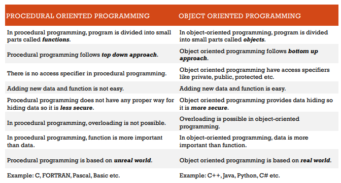

- [Object oriented paradigm](#object-oriented-paradigm)
  - [**Procedural Programming Paradigm**](#procedural-programming-paradigm)
    - [**Key Characteristics:**](#key-characteristics)
    - [**Advantages:**](#advantages)
    - [**Disadvantages:**](#disadvantages)
    - [**Common Languages:**](#common-languages)
    - [**Weaknesses of Procedural Programming:**](#weaknesses-of-procedural-programming)
- [**The Rise of Object-Oriented Programming (OOP):**](#the-rise-of-object-oriented-programming-oop)
    - [**Key Features of OOP:**](#key-features-of-oop)
    - [**Why OOP Became Popular:**](#why-oop-became-popular)
    - [**Examples of OOP Languages:**](#examples-of-oop-languages)
  - [**Key OOP Concepts:**](#key-oop-concepts)
    - [1. **Object**](#1-object)
    - [2. **Class**](#2-class)
    - [3. **Inheritance**](#3-inheritance)
    - [4. **Data Abstraction**](#4-data-abstraction)
    - [5. **Encapsulation**](#5-encapsulation)
    - [6. **Polymorphism**](#6-polymorphism)
    - [**Summary:**](#summary)

# Object oriented paradigm

## **Procedural Programming Paradigm**

**Procedural Programming Paradigm** is a programming approach centered around the concept of procedures or routines, which are sequences of instructions executed in a specific order. It focuses on a step-by-step process to solve a problem by breaking down tasks into functions or procedures, emphasizing a clear flow of control.

### **Key Characteristics:**

- **Sequential Execution:** Code is executed in a linear, step-by-step manner.
- **Function/Procedure Use:** Reusable blocks of code (functions or procedures) are used to perform specific tasks.
- **Global State:** Variables can be shared across functions, often using global variables.
- **Modularity:** Programs are divided into smaller parts (functions), making them easier to manage and debug.
- **Control Structures:** It relies heavily on control structures like loops (`for`, `while`), conditionals (`if`, `switch`), and function calls.

### **Advantages:**

- **Simple to Learn:** Easier to grasp for beginners due to its straightforward structure.
- **Efficient for Smaller Projects:** Well-suited for simple, linear problems.
- **Code Reusability:** Functions can be reused in different parts of the program.

### **Disadvantages:**

- **Less Scalable:** Becomes complex and hard to maintain as the codebase grows.
- **Tight Coupling:** Functions often depend on shared global variables, leading to potential side effects.
- **Limited Abstraction:** Procedural programming doesn’t provide built-in mechanisms for data encapsulation like Object-Oriented Programming (OOP).

### **Common Languages:**

- **C**
- **BASIC**
- **Pascal**
- **Fortran**

Procedural programming is still widely used, especially in systems programming, embedded systems, and applications where performance and low-level control are crucial.

### **Weaknesses of Procedural Programming:**

1. **Poor Scalability:**
    - As programs grow larger, managing and understanding the code becomes difficult due to the lack of structure and modularization for complex systems.
2. **Code Reusability Limitations:**
    - Functions in procedural programming focus on actions rather than representing real-world entities, making it harder to reuse and extend code in different contexts.
3. **Global State Issues:**
    - Heavy reliance on global variables leads to side effects where changes in one part of the program can unintentionally affect others, making debugging harder.
4. **Tight Coupling:**
    - Functions often depend on other functions and shared variables, reducing modularity and increasing maintenance challenges.
5. **Limited Abstraction:**
    - Procedural programming lacks mechanisms for encapsulating data and behavior together, making code less intuitive and harder to maintain over time.

---

# **The Rise of Object-Oriented Programming (OOP):**

To address the limitations of procedural programming, **Object-Oriented Programming (OOP)** emerged, introducing a paradigm that models software around real-world entities and their interactions.



### **Key Features of OOP:**

1. **Encapsulation:**
    - Bundles data (attributes) and behavior (methods) into objects, protecting data from unintended interference and promoting modularity.
2. **Inheritance:**
    - Allows classes to inherit properties and behaviors from other classes, promoting code reuse and reducing redundancy.
3. **Polymorphism:**
    - Enables objects to be treated as instances of their parent class, allowing flexibility in function behavior based on the object type.
4. **Abstraction:**
    - Simplifies complex systems by exposing only the necessary details, hiding implementation complexities.
5. **Modularity and Reusability:**
    - Objects and classes make large codebases easier to manage, extend, and test, which is crucial for scalable applications.

---

### **Why OOP Became Popular:**

1. **Better Modeling of Real-World Problems:**
    - OOP allows developers to represent real-world entities, making software design more intuitive and aligned with real-world concepts.
2. **Improved Maintainability:**
    - Clear separation of concerns (data and behavior) helps in maintaining and upgrading large systems over time.
3. **Reusability & Extensibility:**
    - OOP encourages reusing and extending existing code, reducing development time and costs.
4. **Enhanced Collaboration:**
    - OOP's modular approach allows multiple developers to work on different parts of the system simultaneously, enhancing team productivity.

---

### **Examples of OOP Languages:**

- **Java**
- **C++**
- **Python**
- **C#**
- **Ruby**

OOP’s structured, scalable, and real-world-oriented approach made it a dominant paradigm in software development, especially for large and complex systems like enterprise applications, games, and frameworks.


## **Key OOP Concepts:**


### 1. **Object**

An **object** is an instance of a class that represents a real-world entity with **attributes** (data) and **methods** (behavior). Each object has its own state and can interact with other objects.

- **Example:**

    ```cpp
    class Car {
        public:
            string brand;
            void start() {
                cout << "Car started" << endl;
            }
    };

    Car myCar;  // Object creation
    myCar.brand = "Toyota";
    myCar.start();  // Output: Car started

    ```


---

### 2. **Class**

A **class** is a blueprint or template for creating objects. It defines the **attributes** (variables) and **methods** (functions) that describe the behavior and state of its objects.

- **Example:**

    ```cpp
    class Car {
        public:
            string brand;
            int speed;
            void start() {
                cout << brand << " is starting at " << speed << " km/h" << endl;
            }
    };

    ```


---

### 3. **Inheritance**

**Inheritance** allows a new class (derived class) to inherit attributes and methods from an existing class (base class), promoting **code reuse** and **hierarchical relationships**.

- **Example:**

    ```cpp
    class Vehicle {
        public:
            int wheels;
            void move() {
                cout << "Vehicle is moving" << endl;
            }
    };

    class Car : public Vehicle {  // Car inherits from Vehicle
        public:
            string brand;
    };

    Car myCar;
    myCar.wheels = 4;  // Inherited property
    myCar.move();      // Output: Vehicle is moving

    ```


---

### 4. **Data Abstraction**

**Data abstraction** hides unnecessary details and shows only the essential features of an object. It focuses on **what** an object does rather than **how** it does it.

- **Example:**

    ```cpp
    class ATM {
        public:
            void withdrawMoney() {
                cout << "Enter amount and confirm" << endl;
            }
    };
    // The user doesn't know how the ATM internally processes the withdrawal.

    ```


---

### 5. **Encapsulation**

**Encapsulation** bundles data (attributes) and methods (behavior) into a single unit (class) and restricts direct access to some components, often using **access modifiers** like `private`, `protected`, and `public`.

- **Example:**

    ```cpp
    class Account {
        private:
            double balance;
        public:
            void setBalance(double b) {
                if (b > 0) balance = b;
            }
            double getBalance() {
                return balance;
            }
    };

    Account myAccount;
    myAccount.setBalance(500);  // Access balance indirectly
    cout << myAccount.getBalance();  // Output: 500

    ```


---

### 6. **Polymorphism**

**Polymorphism** allows objects to take many forms, enabling different objects to respond to the same method call in different ways. There are two types:

- **Compile-time (method overloading)**
- **Run-time (method overriding)**
- **Example of Overloading (Compile-time Polymorphism):**

    ```cpp
    class Calculator {
        public:
            int add(int a, int b) {
                return a + b;
            }
            double add(double a, double b) {
                return a + b;
            }
    };

    Calculator calc;
    cout << calc.add(3, 4);        // Output: 7
    cout << calc.add(3.5, 4.2);    // Output: 7.7

    ```

- **Example of Overriding (Run-time Polymorphism):**

    ```cpp
    class Animal {
        public:
            virtual void sound() {
                cout << "Animal sound" << endl;
            }
    };

    class Dog : public Animal {
        public:
            void sound() override {
                cout << "Bark" << endl;
            }
    };

    Animal *animalPtr = new Dog();
    animalPtr->sound();  // Output: Bark (method overridden)

    ```


---

### **Summary:**

- **Object**: Instance of a class.
- **Class**: Blueprint for objects.
- **Inheritance**: Reusing code through class hierarchy.
- **Data Abstraction**: Hiding internal details.
- **Encapsulation**: Bundling data and behavior with restricted access.
- **Polymorphism**: One interface, multiple behaviors.

These principles make OOP powerful for creating scalable, maintainable, and modular software systems.
