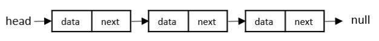
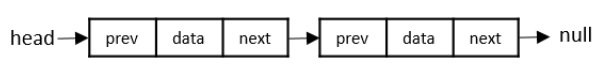
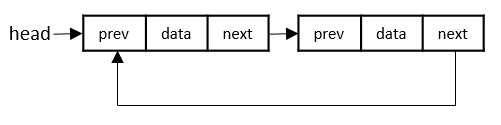
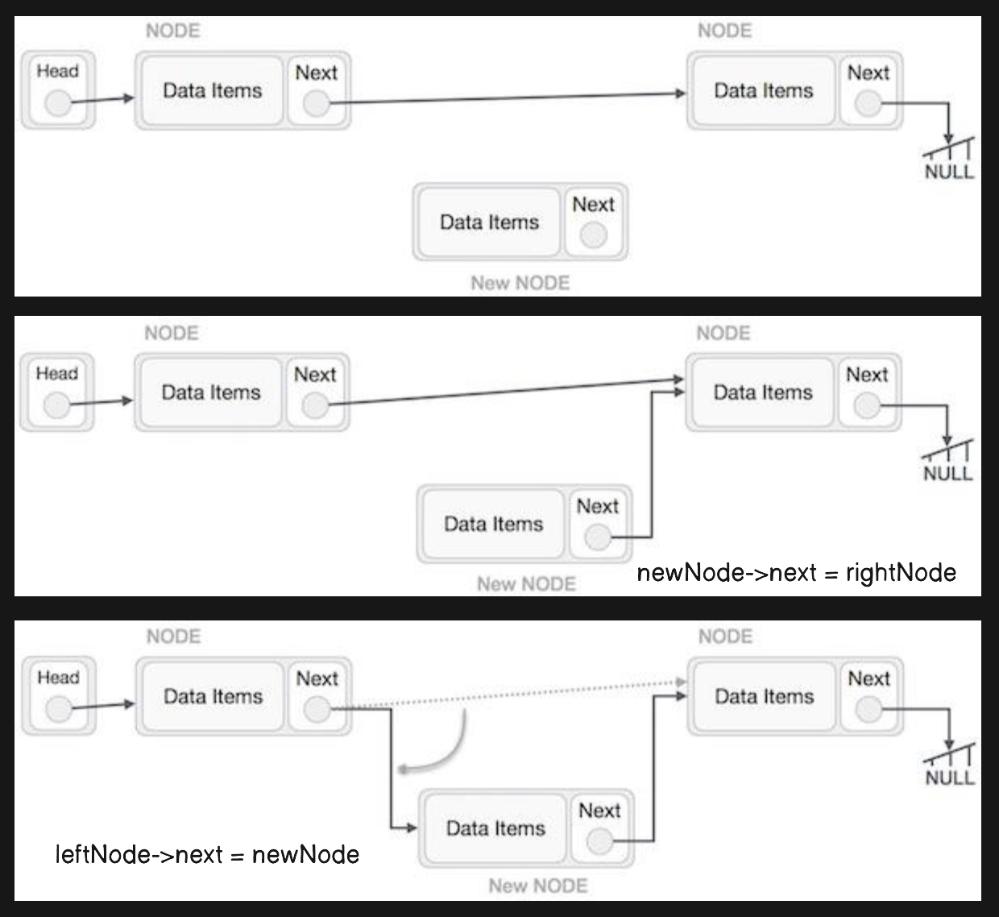

- [1. **What is a Linked List?**](#1-what-is-a-linked-list)
- [2. **Types of Linked Lists**](#2-types-of-linked-lists)
  - [2.1. **Singly Linked List**](#21-singly-linked-list)
  - [2.2. **Doubly Linked List**](#22-doubly-linked-list)
  - [2.3. **Circular Linked List**](#23-circular-linked-list)
- [3. **Basic Operations on Linked Lists**](#3-basic-operations-on-linked-lists)
  - [3.1. **Insertion**](#31-insertion)
    - [**At the Beginning**](#at-the-beginning)
    - [**Insertion at Ending**](#insertion-at-ending)
    - [**Inserting at a Specific Position**](#inserting-at-a-specific-position)
  - [3.2. **Deletion**](#32-deletion)
    - [**Deleting the First Node**](#deleting-the-first-node)
    - [**Deleting the Last Node**](#deleting-the-last-node)
    - [**Deleting a Node at a Specific Position**](#deleting-a-node-at-a-specific-position)
  - [3.3. **Traversal**](#33-traversal)
  - [3.4. **Searching**](#34-searching)
  - [3.5. **Reversal Operation**](#35-reversal-operation)
- [4. **Advantages of Linked Lists**](#4-advantages-of-linked-lists)
- [5. **Disadvantages of Linked Lists**](#5-disadvantages-of-linked-lists)
- [6. **Example of a Singly Linked List in C**](#6-example-of-a-singly-linked-list-in-c)
- [7. Summary](#7-summary)
- [8. References](#8-references)

Linked lists are a fundamental data structure in C and many other programming languages. They allow you to dynamically manage collections of data by linking elements together, unlike arrays, which have a fixed size. Let’s explore the basics, types, and operations of linked lists, as well as some advantages and disadvantages.

# 1. **What is a Linked List?**
A **linked list** is a linear data structure where each element, called a **node**, contains a **data part** and a **pointer** (or link) that points to the next node in the sequence. Unlike arrays, linked lists don’t store elements in contiguous memory locations. Instead, they are made up of nodes scattered across memory, with pointers connecting them in a sequence.

Each node generally has two parts:
- **Data**: Stores the value or information.
- **Pointer**: Points to the next node in the list.


A linked list starts with a head node which points to the first node. Every node consists of data which holds the actual data (value) associated with the node and a next pointer which holds the memory address of the next node in the linked list. The last node is called the tail node in the list which points to null indicating the end of the list.

# 2. **Types of Linked Lists**
Linked lists come in various forms depending on the number of pointers in each node and how nodes are linked. The primary types are:

## 2.1. **Singly Linked List**
   - Each node contains data and a pointer to the next node.
   - The last node has a `NULL` pointer indicating the end of the list.
   - You can traverse it in one direction (from the head to the end).

   ```c
   struct Node {
       int data;
       struct Node* next;
   };
   ```
   
## 2.2. **Doubly Linked List**
   - Each node has three parts: data, a pointer to the next node, and a pointer to the previous node.
   - Allows traversal in both directions (from head to tail and vice versa).

   ```c
   struct Node {
       int data;
       struct Node* next;
       struct Node* prev;
   };
   ```

## 2.3. **Circular Linked List**
   - The last node points back to the first node, forming a circular structure.
   - This can be singly or doubly linked.
   - Useful for implementing cyclic structures like round-robin scheduling.

   ```c
   struct Node {
       int data;
       struct Node* next;
   };
   ```


# 3. **Basic Operations on Linked Lists**
Here’s an overview of common operations you can perform on linked lists:

## 3.1. **Insertion**
   - **At the Beginning**: Insert a new node at the start and update the head pointer.
   - **At the End**: Traverse to the end and add the new node there.
   - **At a Specific Position**: Traverse to the desired position and adjust pointers to insert the node.
   -

### **At the Beginning**
Insert a new node at the start and update the head pointer.

**Algorithm**
1. START
2. Create a node to store the data
3. Check if the list is empty
4. If the list is empty, add the data to the node and
   assign the head pointer to it.
5. If the list is not empty, add the data to a node and link to the
   current head. Assign the head to the newly added node.
6. END

```c
void insertAtBeginning(struct Node** head, int newData) {
    // Step 1: Allocate memory for new node
    struct Node* newNode = (struct Node*)malloc(sizeof(struct Node));

    // Step 2: Insert data into the new node
    newNode->data = newData;

    // Step 3: Make the new node's next point to the current head
    newNode->next = *head;

    // Step 4: Move head to point to the new node
    *head = newNode;
}

```

### **Insertion at Ending**
In this operation, we are adding an element at the ending of the list.

**Algorithm**
1. START
2. Create a new node and assign the data
3. Find the last node
4. Point the last node to new node (If the linked list is empty, make the new node as head)
5. END

```c
void insertAtEnd(struct Node** head, int newData) {
    // Step 1: Allocate memory for new node
    struct Node* newNode = (struct Node*)malloc(sizeof(struct Node));
    struct Node* last = *head;

    // Step 2: Insert data into the new node
    newNode->data = newData;

    // Step 3: This new node will be the last node, so make next of it as NULL
    newNode->next = NULL;

    // Step 4: If the linked list is empty, make the new node as head
    if (*head == NULL) {
        *head = newNode;
        return;
    }

    // Step 5: Otherwise, traverse to the last node
    while (last->next != NULL) {
        last = last->next;
    }

    // Step 6: Change the next of the last node to new node
    last->next = newNode;
}

```

### **Inserting at a Specific Position**
In this operation, we are adding an element at any position within the list.

**Algorithm**
1. START
2. Traverse the list until you reach the node just before the desired position.
3. Insert the new node by adjusting the next pointers accordingly.
4. END

```c
void insertAtPosition(struct Node** head, int newData, int position) {
    // Step 1: Allocate memory for new node
    struct Node* newNode = (struct Node*)malloc(sizeof(struct Node));
    newNode->data = newData;

    // Special case: inserting at the head position
    if (position == 0) {
        newNode->next = *head;
        *head = newNode;
        return;
    }

    // Step 2: Find the node before the position where we want to insert
    struct Node* temp = *head;
    for (int i = 0; i < position - 1 && temp != NULL; i++) {
        temp = temp->next;
    }

    // If the position is beyond the end of the list
    if (temp == NULL) {
        printf("Position is out of bounds.\n");
        free(newNode);  // Free the allocated memory
        return;
    }

    // Step 3: Make new node's next point to temp's next
    newNode->next = temp->next;

    // Step 4: Make temp's next point to the new node
    temp->next = newNode;
}


```

## 3.2. **Deletion**
   - **At the Beginning**: Remove the head node and update the head pointer to the next node.
   - **At the End**: Traverse to the second-to-last node, remove the last node, and update the `next` pointer to `NULL`.
   - **At a Specific Position**: Traverse to the node just before the one you want to delete and adjust the pointers to skip over it.

### **Deleting the First Node**
Steps:
- Check if the list is empty. If head is NULL, the list is empty, and there's nothing to delete.
- Set a temporary pointer to point to the head node.
- Move the head pointer to the next node.
- Free the memory of the node that was originally head.

```c
void deleteAtBeginning(struct Node** head) {
    if (*head == NULL) {
        printf("List is empty.\n");
        return;
    }
    struct Node* temp = *head;
    *head = (*head)->next;
    free(temp);
}

```

### **Deleting the Last Node**
Steps:
- Check if the list is empty.
- If there’s only one node, set head to NULL and free the single node.
- Traverse the list to find the second-last node (the node before the last node).
- Set the next pointer of the second-last node to NULL.
- Free the last node.

```c
void deleteAtEnd(struct Node** head) {
    if (*head == NULL) {
        printf("List is empty.\n");
        return;
    }
    if ((*head)->next == NULL) { // Only one node
        free(*head);
        *head = NULL;
        return;
    }
    struct Node* temp = *head;
    while (temp->next->next != NULL) {
        temp = temp->next;
    }
    free(temp->next);
    temp->next = NULL;
}

```

### **Deleting a Node at a Specific Position**
Steps:
- Check if the list is empty.
- If deleting the first node, follow the process outlined above.
- Traverse the list to reach the node before the one you wish to delete.
- Update the next pointer of the node before the target to skip over the target node.
- Free the target node.

```c
void deleteAtPosition(struct Node** head, int position) {
    if (*head == NULL) {
        printf("List is empty.\n");
        return;
    }
    struct Node* temp = *head;

    if (position == 0) {
        *head = temp->next;
        free(temp);
        return;
    }

    for (int i = 0; temp != NULL && i < position - 1; i++) {
        temp = temp->next;
    }

    if (temp == NULL || temp->next == NULL) {
        printf("Position does not exist.\n");
        return;
    }

    struct Node* next = temp->next->next;
    free(temp->next);
    temp->next = next;
}

```

## 3.3. **Traversal**
   - Start from the head node and visit each node by following the pointers until you reach `NULL`.

   ```c
   void printList(struct Node* head) {
       struct Node* current = head;
       while (current != NULL) {
           printf("%d -> ", current->data);
           current = current->next;
       }
       printf("NULL\n");
   }
   ```

## 3.4. **Searching**
   - Traverse through each node until you find the desired value or reach the end of the list.

## 3.5. **Reversal Operation**
Reversing a linked list involves changing the direction of the `next` pointers of each node, so that the last node becomes the first and the `head` pointer points to the last node. Here, we’ll go through the reversal process for a singly linked list.

#### Steps to Reverse a Linked List
1. **Initialize Pointers**:
   - Set up three pointers: `prev`, `current`, and `next`.
   - `prev` initially points to `NULL`, as it will be the new `next` pointer for the original first node.
   - `current` points to the `head`, which is the node currently being processed.
   - `next` will hold the `next` node to help move through the list without losing the reference.

2. **Iterate Through the List**:
   - While `current` is not `NULL`, do the following:
     1. **Save the Next Node**: Set `next` to `current->next`.
     2. **Reverse the Link**: Update `current->next` to point to `prev`.
     3. **Move `prev` and `current`**: Move `prev` to `current` and `current` to `next`.

3. **Update the Head Pointer**:
   - Once `current` becomes `NULL` (end of the list), `prev` will be pointing to the new head of the reversed list. Update the `head` pointer to `prev`.

#### Example Code for Reversing a Linked List in C
Here is how you can implement the reversal operation in C:

```c
#include <stdio.h>
#include <stdlib.h>

struct Node {
    int data;
    struct Node* next;
};

void reverse(struct Node** head) {
    struct Node* prev = NULL;
    struct Node* current = *head;
    struct Node* next = NULL;

    while (current != NULL) {
        next = current->next; // Store next node
        current->next = prev; // Reverse current node's pointer
        prev = current;       // Move pointers one position ahead
        current = next;
    }
    *head = prev; // Update head to the new front node
}

// Helper functions to create and print the list
void push(struct Node** head, int data) {
    struct Node* new_node = (struct Node*) malloc(sizeof(struct Node));
    new_node->data = data;
    new_node->next = *head;
    *head = new_node;
}

void printList(struct Node* node) {
    while (node != NULL) {
        printf("%d ", node->data);
        node = node->next;
    }
}

int main() {
    struct Node* head = NULL;
    push(&head, 1);
    push(&head, 2);
    push(&head, 3);
    push(&head, 4);

    printf("Original List:\n");
    printList(head);

    reverse(&head);

    printf("\nReversed List:\n");
    printList(head);

    return 0;
}
```

#### Explanation of the Code:
1. **Initialization**: The `reverse()` function initializes `prev` to `NULL` and `current` to the `head` of the list.
2. **Loop Through the List**: The `while` loop iterates through each node. Within each iteration:
   - The `next` pointer saves the current node’s `next` node, so we don’t lose track of the rest of the list.
   - The `current->next` pointer is updated to point back to `prev`, effectively reversing the direction for that node.
   - Both `prev` and `current` move one step forward.
3. **Update Head**: Once the loop finishes, `prev` points to the last node, which is the new head of the reversed list. The original `head` is updated to `prev`.

#### How It Works Step-by-Step
Let’s say we start with the list `1 -> 2 -> 3 -> 4 -> NULL`. Here’s how the reversal proceeds:

- **First Iteration**:
  - `current` is `1`, `prev` is `NULL`, and `next` is `2`.
  - Set `current->next` to `prev` (makes `1 -> NULL`).
  - Move `prev` to `1` and `current` to `2`.

- **Second Iteration**:
  - `current` is `2`, `prev` is `1`, and `next` is `3`.
  - Set `current->next` to `prev` (makes `2 -> 1`).
  - Move `prev` to `2` and `current` to `3`.

- **Third Iteration**:
  - `current` is `3`, `prev` is `2`, and `next` is `4`.
  - Set `current->next` to `prev` (makes `3 -> 2`).
  - Move `prev` to `3` and `current` to `4`.

- **Fourth Iteration**:
  - `current` is `4`, `prev` is `3`, and `next` is `NULL`.
  - Set `current->next` to `prev` (makes `4 -> 3`).
  - Move `prev` to `4` and `current` to `NULL`.

After the final iteration, `current` becomes `NULL`, and `prev` points to `4`, which is now the new head of the reversed list. The list is now `4 -> 3 -> 2 -> 1 -> NULL`.

#### Key Points
- **Time Complexity**: The reversal process is `O(n)` because we traverse each node only once.
- **Space Complexity**: This approach is `O(1)` because it uses a constant amount of extra space for the pointers (`prev`, `current`, `next`).

Reversing a linked list is a fundamental operation and an excellent example of pointer manipulation, helping you deepen your understanding of how linked lists work in memory.

# 4. **Advantages of Linked Lists**
   - **Dynamic Size**: Unlike arrays, linked lists can grow or shrink in size as needed, making them ideal for dynamic memory allocation.
   - **Efficient Insertions/Deletions**: You can insert or delete nodes in a linked list with fewer operations than in an array, where shifting elements may be required.
   - **No Wasted Memory**: Linked lists only use as much memory as they need for the nodes, while arrays may have unused space if they’re not fully populated.

# 5. **Disadvantages of Linked Lists**
   - **Memory Overhead**: Each node requires extra memory for the pointer(s), which can add up, especially with large lists.
   - **No Direct Access**: Accessing an element requires traversal from the head node, making linked lists slower than arrays for random access.
   - **More Complex Code**: Linked lists are harder to implement and manage than arrays, requiring more careful handling of pointers.

# 6. **Example of a Singly Linked List in C**
Here’s an example of how you might implement a simple singly linked list with insertion and traversal in C:

```c
#include <stdio.h>
#include <stdlib.h>

// Define the Node structure
struct Node {
    int data;
    struct Node* next;
};

// Function to create a new node
struct Node* createNode(int data) {
    struct Node* newNode = (struct Node*)malloc(sizeof(struct Node));
    newNode->data = data;
    newNode->next = NULL;
    return newNode;
}

// Function to insert a new node at the end
void insertEnd(struct Node** head, int data) {
    struct Node* newNode = createNode(data);
    if (*head == NULL) {
        *head = newNode;
        return;
    }
    struct Node* current = *head;
    while (current->next != NULL) {
        current = current->next;
    }
    current->next = newNode;
}

// Function to print the list
void printList(struct Node* head) {
    struct Node* current = head;
    while (current != NULL) {
        printf("%d -> ", current->data);
        current = current->next;
    }
    printf("NULL\n");
}

// Main function to demonstrate usage
int main() {
    struct Node* head = NULL;
    insertEnd(&head, 10);
    insertEnd(&head, 20);
    insertEnd(&head, 30);
    insertEnd(&head, 40);

    printf("Linked List: ");
    printList(head);

    return 0;
}
```

# 7. Summary
Linked lists are a versatile data structure that offers dynamic memory allocation, allowing easy insertion and deletion of nodes. They are particularly useful when you need a flexible data structure where the size may change over time. Understanding linked lists is fundamental for learning more complex data structures like stacks, queues, and graphs.

# 8. References
* [Geeksforgeeks](https://www.geeksforgeeks.org/linked-list-in-c/)
* [tutorialspoint](https://www.tutorialspoint.com/data_structures_algorithms/linked_list_algorithms.htm)
